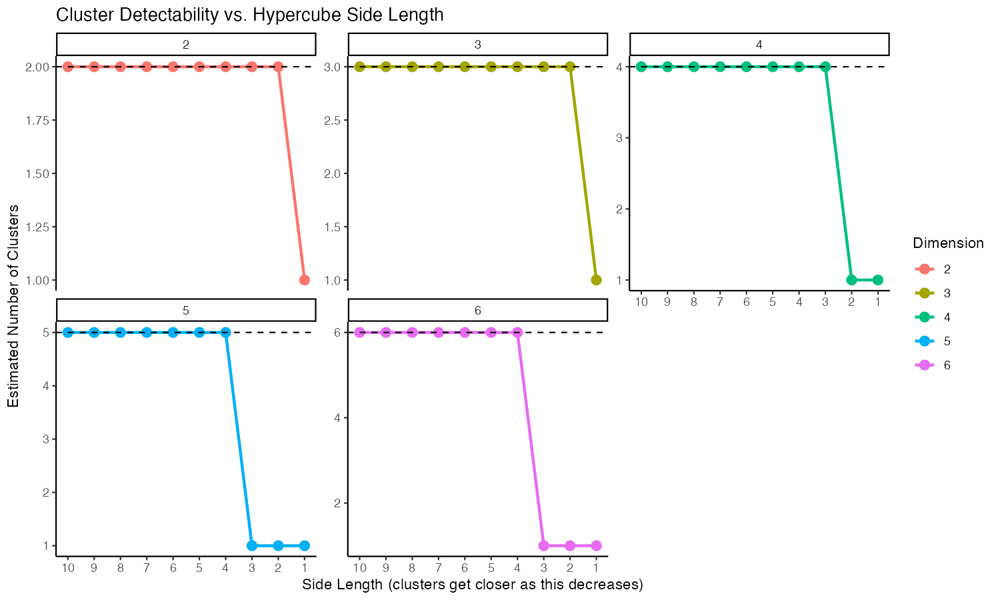
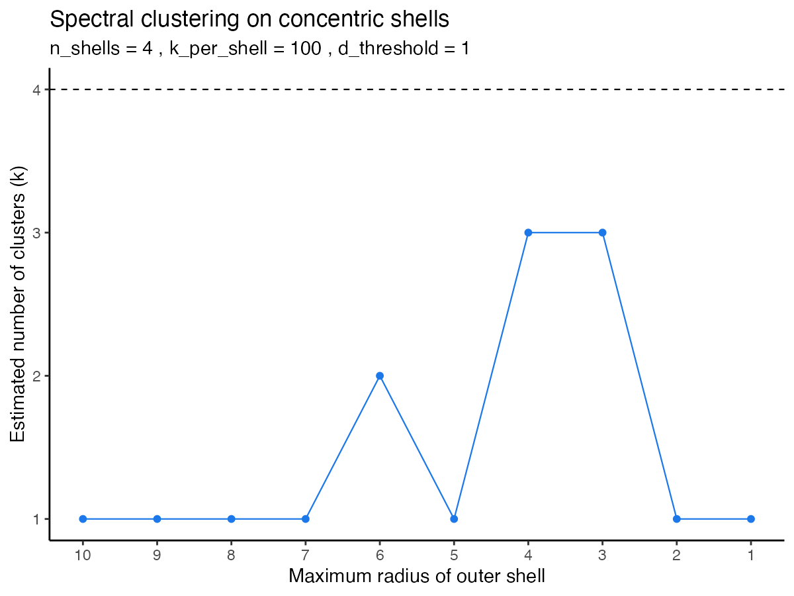

# Task 1 - Clusters and the Gap Statistic



In this simulation, the dimensionality (n) determines both the number of features and the number of cluster centers, because the cluster centers were placed at the positive corners of an n-dimensional hypercube. Thus, increasing n increases the number of clusters in the dataset.

The results show that as n increases from 2 to 6, the Gap Statistic becomes less robust, requiring greater separation between cluster centers (larger side_length) to correctly recover all n clusters.

For lower-dimensional cases (e.g., 2 or 3 dimensions → 2–3 clusters), the method identifies the correct number of clusters even when the centers are relatively close (lower side_length).

For higher-dimensional cases with more clusters (e.g., 5 or 6 clusters), the estimated number of clusters collapses to 1 once the side_length drops below ~3-4.

Overall, the Gap Statistic struggles more when many clusters are packed into a space with limited separation.


# Task 2 - Spectral Clustering on Concentric Shells
```{r, results='asis', echo=FALSE}
cat('<iframe src="figures/shell_clusters_3d_plot.html"
         width="600" height="600" frameborder="0"></iframe>')
```

